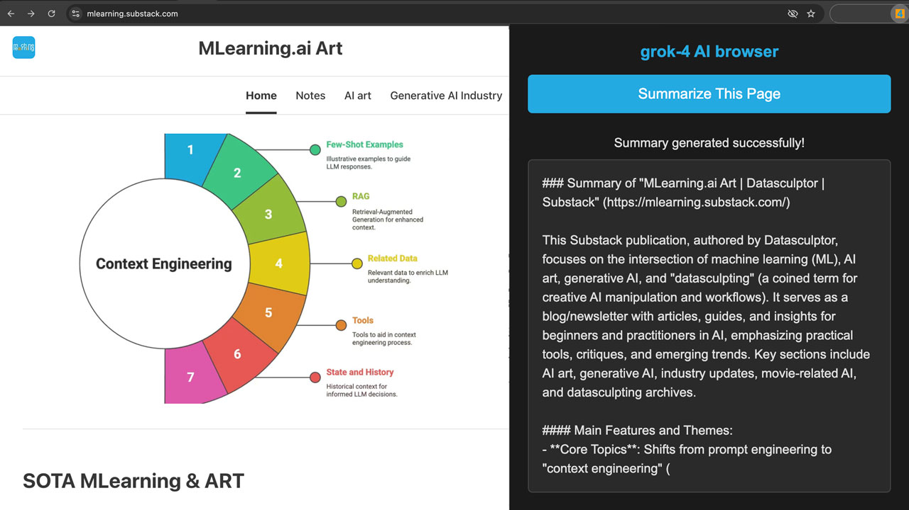

# 🤖 X.AI Website Summarizer

<div align="center">
  
  
  [](https://chrome.google.com/webstore)
  [](https://opensource.org/licenses/MIT)
  [](https://x.ai/)
  
  **Instantly summarize any webpage using X.AI's powerful Grok model**
  
  [Features](#-features) • [Installation](#-installation) • [Configuration](#-configuration) • [Usage](#-usage) • [Contributing](#-contributing)
</div>

---

## 📖 Overview

X.AI Website Summarizer is a Chrome extension that leverages the power of X.AI's Grok model to provide instant, intelligent summaries of any webpage. With just one click, transform lengthy articles, blog posts, and documentation into concise, digestible summaries.

## 📸 Extension Preview

<p align="center">
  
</p>

## ✨ Features

- 🚀 **One-Click Summarization** - Instantly summarize any webpage with a single click
- 🎯 **Smart Content Extraction** - Intelligently identifies and extracts main content from pages
- 🤖 **Powered by Grok** - Uses X.AI's advanced Grok-4 model for high-quality summaries
- 🎨 **Modern Dark UI** - Sleek, user-friendly interface with dark theme
- ⚡ **Fast & Efficient** - Optimized for quick response times
- 🔒 **Privacy-Focused** - Content processing happens securely through X.AI's API
- 📏 **Smart Truncation** - Handles long articles by intelligently selecting the most important content

## 🚀 Installation

### From Source (Development)

1. **Clone the repository**
   ```bash
   git clone https://github.com/yourusername/xai-summarizer.git
   cd xai-summarizer
   ```

2. **Get your X.AI API Key**
   - Visit [X.AI Console](https://console.x.ai/) to obtain your API key
   - Sign up for an account if you haven't already

3. **Configure the extension**
   - Open `background.js`
   - Replace `<YOUR_XAI_API_KEY_HERE>` with your actual API key:
   ```javascript
   const XAI_API_KEY = 'your-actual-api-key-here';
   ```

4. **Load the extension in Chrome**
   - Open Chrome and navigate to `chrome://extensions/`
   - Enable "Developer mode" in the top right
   - Click "Load unpacked"
   - Select the `xai-summarizer` directory

### From Chrome Web Store (Coming Soon)

The extension will be available on the Chrome Web Store soon. Stay tuned!

## ⚙️ Configuration

### API Key Setup

For security reasons, you need to add your own X.AI API key:

1. Get your API key from [X.AI Console](https://console.x.ai/)
2. Open `background.js` in your favorite text editor
3. Replace the placeholder with your API key:
   ```javascript
   const XAI_API_KEY = 'xai-YOUR-API-KEY-HERE';
   ```
4. Save the file and reload the extension in Chrome

> ⚠️ **Important**: Never share your API key publicly or commit it to version control!

### Future Enhancement: Secure Configuration

We're working on implementing a secure configuration page where you can enter your API key through the extension's options without modifying the code directly.

## 📋 Usage

1. **Navigate to any webpage** you want to summarize
2. **Click the X.AI Summarizer icon** in your Chrome toolbar
3. **Click "Summarize This Page"** in the popup
4. **Wait a few seconds** while Grok processes the content
5. **Read your summary** in the popup window

### Tips for Best Results

- Works best on article-based websites, blogs, and documentation
- The extension automatically extracts the main content area
- For very long articles, the most relevant sections are prioritized
- Some websites with complex layouts may require manual text selection (feature coming soon)

## 🛠️ Technologies Used

- **Chrome Extensions Manifest V3** - Modern extension architecture
- **X.AI Grok API** - Advanced AI model for text summarization
- **Vanilla JavaScript** - No dependencies, pure performance
- **Chrome APIs** - `chrome.tabs`, `chrome.scripting`, `chrome.runtime`

## 🤝 Contributing

We welcome contributions! Please see our [Contributing Guidelines](CONTRIBUTING.md) for details.

### Development Setup

1. Fork the repository
2. Create your feature branch (`git checkout -b feature/AmazingFeature`)
3. Commit your changes (`git commit -m 'Add some AmazingFeature'`)
4. Push to the branch (`git push origin feature/AmazingFeature`)
5. Open a Pull Request

### Roadmap

- [ ] Options page for API key configuration
- [ ] Multiple summary lengths (brief, standard, detailed)
- [ ] Summary history and bookmarking
- [ ] Export summaries (Markdown, PDF)
- [ ] Support for multiple languages
- [ ] Firefox and Edge versions
- [ ] Batch summarization for multiple tabs
- [ ] Custom prompts for specialized summaries

## 📝 License

This project is licensed under the MIT License - see the [LICENSE](LICENSE) file for details.

## 🔒 Security

- API keys are stored locally and never transmitted except to X.AI's official API
- No user data is collected or stored
- All summaries are processed in real-time and not retained

For security concerns, please see our [Security Policy](SECURITY.md).

## 🙏 Acknowledgments

- Thanks to [X.AI](https://x.ai/) for providing the powerful Grok API
- Chrome Extensions documentation and community
- All contributors and users of this extension

---

<div align="center">
  Made with ❤️ by developers, for developers
  
  If you find this extension helpful, please consider giving it a ⭐ on GitHub!
</div>
